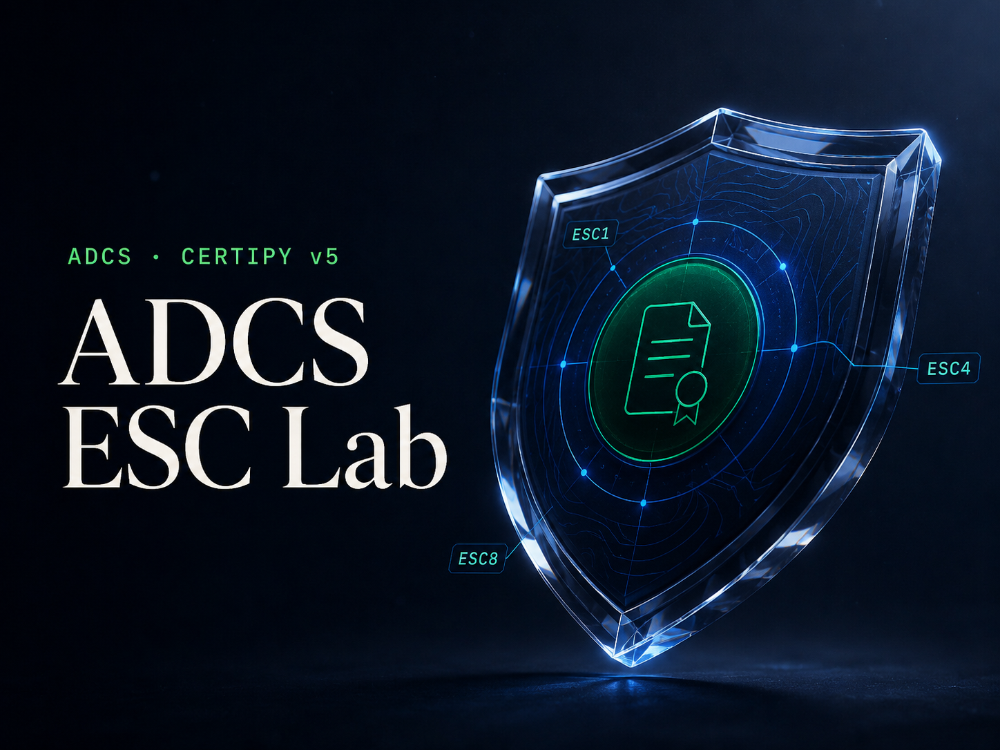

<p align="center">
  
</p>

<p align="center">
  <video src="Multimedia/Demo%20Musica.mp4" width="100%" controls autoplay loop muted></video>
</p>

<p align="center">
  <strong>Aprende a reconocer los 16 ESC por su firma, no de memoria.</strong><br/>
  Un laboratorio visual y local para recorrer <code>find → signature → ESC → mitigate</code> con Certipy v5.
</p>


<p align="center">
  
  
  
  
  
  
</p>

<p align="center">
  <a href="#qué-es-adcs-esc-lab">Visión</a> ·
  <a href="#características">Características</a> ·
  <a href="#inicio-rápido">Inicio rápido</a> ·
  <a href="#rutas-de-la-aplicación">Recorrido</a>
</p>

> **Solo para entornos controlados y autorizados:** HackTheBox, TryHackMe, VulnHub, laboratorios propios y entornos de práctica con permiso explícito.

---

## ¿Qué es ADCS ESC Lab?

ADCS ESC Lab es una aplicación web local para **aprender a identificar y entender los 16 casos ESC** (Escalation Scenarios) de Active Directory Certificate Services, alineada con **Certipy v5**.

Combina mapa visual, tabla comparativa, fichas por ESC, escenarios guiados, árbol de decisión, cheat sheet y sección blue team — todo con interfaz **glassmorphism**, **9 acentos de color** e **i18n ES/EN**.

El flujo típico en un lab con ADCS:

```
certipy-ad find → identificar ESC → leer vector en /esc/ESCn → practicar en /practica → mitigar en /blue-team
```

---

## Características

- **16 ESC documentados** — Desde ESC1 hasta ESC16, agrupados por vector (plantillas, ACL, configuración, relay, mapping, CA)
- **Mapa interactivo** — Vista visual del recorrido y relaciones entre casos
- **Tabla comparativa** — Criterios, prerrequisitos y señales de detección en un vistazo
- **Práctica guiada** — Escenarios con contexto de laboratorio y comandos Certipy
- **Árbol de decisión** — Ayuda a acotar qué ESC investigar según el output
- **Cheat sheet** — Referencia rápida para pentest en lab
- **Blue team** — Mitigaciones, parches y hardening
- **UI glass** — Tema oscuro y claro con paneles translúcidos, mesh de color y paleta de acentos intercambiable
- **100% local** — Sin dependencias de plataformas externas; listo para clonar y desplegar tú mismo

---

## Interfaz (Modo Claro / Oscuro)

La aplicación cuenta con una interfaz responsiva basada en **Glassmorphism**, adaptada tanto para modo oscuro como claro:

<p align="center">
  
  
</p>

---


## Requisitos

| Requisito | Versión |
|-----------|---------|
| Node.js | 20+ |
| npm | 10+ |

Herramientas de referencia en el lab (no incluidas en el repo):

| Tool | Uso |
|------|-----|
| `certipy-ad` | Enumeración y explotación ADCS (v5) |
| `BloodHound` | Visualización de relaciones AD |
| `netexec` / `impacket` | Validación de credenciales y relay |

---

## Inicio rápido

```bash
# Clonar el repositorio
git clone https://github.com/heindall92/ADCS-ESC-Lab.git
cd ADCS-ESC-Lab

# Instalar dependencias
npm install

# Desarrollo — http://localhost:8080
npm run dev

# Build de producción
npm run build

# Vista previa del build
npm run preview
```

---

## Rutas de la aplicación

| Ruta | Descripción |
|------|-------------|
| `/` | Home, hero con terminal animado y tutorial |
| `/mapa` | Mapa visual de los ESC |
| `/tabla` | Tabla comparativa de todos los casos |
| `/esc/$escId` | Detalle individual (ej. `/esc/ESC1`) |
| `/practica` | Escenarios de práctica guiada |
| `/decision` | Árbol de decisión |
| `/cheat-sheet` | Referencia rápida |
| `/blue-team` | Mitigaciones defensivas |
| `/parche` | Parches y recomendaciones de hardening |

---

## Motion graphic del hero (HyperFrames)

La animación del lado derecho del hero usa [HyperFrames](https://github.com/heygen-com/hyperframes):

| Ruta | Uso |
|------|-----|
| `public/hyperframes/hero/index.html` | Composición servida en la app (loop 8s, glass + GSAP) |
| `hyperframes/hero-motion/` | Proyecto CLI para editar, previsualizar y renderizar |

```bash
# Previsualizar la composición sola
cd hyperframes/hero-motion
npm run dev

# Renderizar a MP4 (requiere FFmpeg instalado)
npm run render
```

La home usa una versión nativa equivalente en React/Motion, sin iframe ni CDN, para que el hero aparezca de inmediato incluso sin conexión. El proyecto HyperFrames queda como fuente editable y exportable a vídeo.

---

```
ADCS-ESC-Lab/
├── docs/
│   ├── readme-banner.svg      # Banner hero original en formato vectorial
│   └── adcs_esc_lab_card.svg  # Tarjeta para README de perfil GitHub
├── Multimedia/                # Capturas de pantalla (modo claro/oscuro) y video demo
├── public/                    # favicon, og.png y videos del hero (hero-certipy, hero-motion)
├── src/
│   ├── routes/                # Páginas TanStack Router
│   ├── components/            # Componentes de la interfaz de usuario (sidebar, tutorial, etc.)
│   ├── lib/
│   │   ├── data/              # Contenido de la teoría de los ESC en ES/EN
│   │   ├── i18n.tsx           # Configuración del traductor local (ES/EN)
│   │   ├── theme.tsx          # Gestión de tema claro/oscuro y acentos de color
│   │   └── accent-palette.ts  # Paleta de 9 colores de acento
│   ├── styles.css             # Estilos de diseño global y efectos glassmorphism
│   ├── server.ts              # Servidor de entrada SSR con manejador de errores
│   └── start.ts               # Configuración inicial del framework
├── vite.config.ts
└── package.json
```

---

## Tarjeta para tu README de perfil

Cuando subas el repo, añade esta tarjeta en la sección **Proyectos** de tu [README de perfil](https://github.com/heindall92/heindall92) (mismo estilo que JUDAS, Heimdall, etc.):

```html
<a href="https://github.com/heindall92/ADCS-ESC-Lab">
  
</a>
```

Vista previa local de la tarjeta:

<p align="center">
  
</p>

---

## Scripts disponibles

| Comando | Acción |
|---------|--------|
| `npm run dev` | Servidor de desarrollo en `:8080` |
| `npm run build` | Build de producción (Nitro + cliente) |
| `npm run preview` | Previsualizar el build |
| `npm run lint` | ESLint |
| `npm run format` | Prettier |

---

## Aviso legal

Este proyecto es **exclusivamente educativo** y está pensado para uso en entornos de práctica **controlados y autorizados**. El uso contra sistemas sin autorización explícita es ilegal. El autor no se hace responsable del mal uso de esta herramienta ni del material que documenta.

---

## Autor

**Yoandy Ramírez Delgado** · Junior Pentester · eJPTv2

[](https://www.linkedin.com/in/yoandyrd92/)
[](https://app.hackthebox.com/profile/heindall)
[](https://github.com/heindall92)
